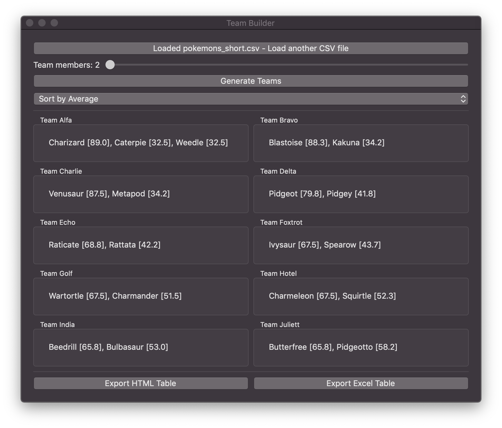

# team-builder

🦀 A GUI program to make teams based on people's skill levels



## How to use it

  * Press the **load CSV file** button
  * Use the slider to specify how many people should be in each team
  * Press the **generate** button

### The `CSV` file must be formatted in the following way

  * The first row is for the name of the skills (except the first field)
  * The following rows are for the people's names and their skill levels, represented by an integer
  * Each column must be divided by a semicolon

### Example `CSV`

```csv
Name;SkillLevel1;SkillLevel2;SkillLevel3
Tizio;1;2;3
Caio;2;2;2
Sempronio;3;2;1
```

## License

The MIT License (MIT)

Copyright © `2019` `Giorgio Pomettini`
